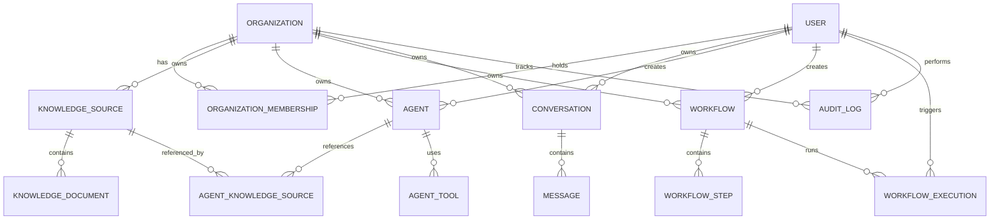

# ORVEX — Enterprise Database Architecture Proposal (Phase 2)

## 1. Executive Summary & Repository Observations

ORVEX is an Enterprise Intelligence & Automation Platform combining AI Assistant, Knowledge Management (RAG), AI Agent Orchestration, Workflow Automation, and Data Analytics into a unified interface.

### Current Frontend Domain Audit

An inspection of the current React/TypeScript frontend repository (`frontend/src/types/` and `frontend/src/services/`) identifies the following domain entities currently backed by mock in-memory state:

1. **Knowledge Management (`knowledge.ts`, `knowledgeRepository.ts`)**:
   - `KnowledgeSource`: Represents a folder/collection (`id`, `name`, `description`).
   - `KnowledgeDocument`: File metadata within a source (`id`, `name`, `type`, `sourceId`, `sizeBytes`, `status`, `readiness`, `summary`, `updatedAt`).
   - *Status Enums*: `DocumentStatus` (`Pending`, `Processing`, `Processed`, `Failed`), `KnowledgeReadiness` (`NotIndexed`, `Indexing`, `Indexed`, `IndexFailed`).

2. **AI Assistant (`assistant.ts`, `assistantRepository.ts`)**:
   - `Conversation`: Chat session (`id`, `title`, `createdAt`, `updatedAt`).
   - `AssistantMessage`: Single message in a conversation (`id`, `role` (`user` | `assistant`), `content`, `createdAt`).

3. **AI Agents (`agent.ts`, `agentRepository.ts`)**:
   - `Agent`: Specialized AI agent configuration (`id`, `name`, `description`, `status` (`Active` | `Paused`), `domain` (`Security`, `Research`, `Data Analytics`, `Human Resources`, `Operations`), `owner`, `tools` (`string[]`), `knowledgeSources` (`string[]`), `systemInstructions`, `requireApproval`, `executions`, `successRate`, `lastRun`).

4. **Workflows (`workflow.ts`, `workflowRepository.ts`)**:
   - `Workflow`: Multi-step automation process (`id`, `name`, `description`, `status` (`Active` | `Draft` | `Paused`), `trigger`, `executions`, `successRate`, `lastRun`, `updatedAt`).
   - `WorkflowStep`: Step node within a workflow (`id`, `type` (`Trigger`, `AI Agent`, `Knowledge Retrieval`, `Action`, `Condition`, `Human Approval`), `title`, `description`, `config`).

5. **Analytics & Metrics (`analyticsRepository.ts`)**:
   - Dynamic aggregated metrics (`totalExecutions`, `successRate`, `activeAgents`, `activeWorkflows`, `ragReadyDocuments`, `avgLatencyMs`, trend points).

### Key Architectural Refinements (V2 Revision)

To transform frontend concepts into a secure, multi-tenant enterprise system:
- **Global User Identity + Organization Memberships**: Users exist globally (`users`). Access to organizations is established through an explicit junction entity (`organization_memberships`), enabling multi-organization participation with per-organization roles (`admin`, `member`, `analyst`).
- **Direct Resource Tenant Scoping**: All tenant-owned domain entities (`knowledge_sources`, `agents`, `workflows`, `conversations`, `audit_logs`) carry an explicit `organization_id` foreign key.
- **Application Tool Registry**: Agent permissions reference application-level tool identifiers (`agent_tools`) validated by the backend tool registry without requiring a separate relational tools table.
- **Branching Workflow Graph Support**: Workflow steps support graph branching via a `next_step_ids` JSONB array on `workflow_steps`.
- **Cross-Tenant Validation Rules**: Service layers explicitly verify that inter-resource relationships (e.g. Agent ↔ Knowledge Source, Workflow Step ↔ Agent) belong to the exact same `organization_id`.

---

## 2. Database Goals & Core Design Principles

1. **Data Integrity & Normalization**: Standard 3NF normalization for core relational data, using strict Foreign Keys (`ON DELETE CASCADE` / `ON DELETE RESTRICT`) and constraint validation.
2. **Tenant Isolation via Memberships**: Global user identities mapped to organizations through `organization_memberships`. Tenant scoping verified at the service/repository layer for every resource request.
3. **Cross-Tenant Relationship Integrity**: Service-level and constraint-level rules ensuring linked resources (e.g. Agent linking to Knowledge Source) share the same `organization_id`.
4. **Structured JSONB Flexibility**: Selective use of PostgreSQL `JSONB` for dynamic step configurations (`config`), graph branching pointers (`next_step_ids`), execution logs (`execution_log`), and audit details (`details`).
5. **Extensibility for RAG**: Schema designed to seamlessly attach vector embeddings (`pgvector`) in Phase 3/4 without requiring relational schema refactoring.
6. **Immutable Enterprise Auditability**: Immutable append-only audit trail capturing key security, resource, user, and workflow operations.

---

## 3. Multi-Tenancy & User Membership Strategy

### Selected Approach: Global User Identity + Organization Memberships

Users represent **global identities** (`users` table with globally unique `email`). Access to an Organization (the primary tenant boundary) is established via `organization_memberships`.

```text
Global User Identity (users)
       │
       ▼
organization_memberships (Tenant Access Boundary: role = admin | member | analyst)
       │
       ▼
Organization (Tenant Boundary)
  ├── Knowledge Sources ──> Knowledge Documents
  ├── Agents ──> (agent_tools, agent_knowledge_sources)
  ├── Workflows ──> workflow_steps ──> workflow_executions
  ├── Conversations ──> Messages
  └── Audit Logs
```

### Rationale & Rules

- **Multi-Organization Belonging**: A single user account can belong to multiple organizations with different roles (e.g., `admin` in Org A, `member` in Org B).
- **Tenant Access Verification**: The service layer must verify that an authenticated user possesses an active row in `organization_memberships` for the target `organization_id` before granting access.
- **Direct Resource Scoping**: Tenant-owned resources (`knowledge_sources`, `agents`, `workflows`, `conversations`, `audit_logs`) carry `organization_id` directly to allow high-performance indexed queries (`WHERE organization_id = :org_id`).
- **Cross-Tenant Guardrail**: When creating inter-resource relationships (e.g. attaching a Knowledge Source to an Agent), the backend service layer MUST verify that both `agent.organization_id` and `knowledge_source.organization_id` match.

---

## 4. Identity, Role & Timestamp Strategy

### Primary Key Strategy: UUIDv4

All primary keys will use **Universally Unique Identifiers (UUIDv4)** (`uuid` column type with default `gen_random_uuid()`).

#### Why UUID over Sequential BIGINT?
- **Anti-Enumeration**: Prevents sequential ID scanning attacks (e.g., `/api/v1/conversations/1` vs `/api/v1/conversations/a0eebc99-...`).
- **Distributed Safety**: Primary keys can be generated safely in application layers or microservices without database round-trips.
- **Multi-Tenant Safety**: Guarantees globally unique IDs across different organizations and environments.

### V1 Role-Based Access Control (RBAC)

For V1, roles are declared directly on `organization_memberships.role`:
- `admin`: Full administrative control over organization settings, memberships, resources, and audit logs.
- `member`: Standard access to create and manage conversations, agents, workflows, and knowledge documents.
- `analyst`: Read-only access to analytics dashboards, workflow executions, and knowledge bases.

*Note: Dedicated `roles`, `permissions`, and `role_permissions` tables are explicitly deferred until fine-grained custom RBAC is required.*

### Timestamp Strategy: UTC TIMESTAMPTZ

All date/time columns will use `TIMESTAMP WITH TIME ZONE` (`TIMESTAMPTZ`), stored strictly in **UTC**.

Every mutable table includes:
- `created_at TIMESTAMPTZ NOT NULL DEFAULT NOW()`
- `updated_at TIMESTAMPTZ NOT NULL DEFAULT NOW()`

An automated PostgreSQL trigger or SQLAlchemy ORM hook will automatically update `updated_at` whenever a row is modified.

---

## 5. Detailed Entity Specifications & Schemas (14 Tables)

### 1. `organizations` (Enterprise Tenant)

| Column | Data Type | Constraints | Description |
| :--- | :--- | :--- | :--- |
| `id` | UUID | PRIMARY KEY, DEFAULT `gen_random_uuid()` | Unique Organization ID |
| `name` | VARCHAR(255) | NOT NULL | Enterprise organization name |
| `slug` | VARCHAR(255) | UNIQUE, NOT NULL | URL-friendly identifier |
| `created_at` | TIMESTAMPTZ | NOT NULL, DEFAULT `NOW()` | Timestamp created |
| `updated_at` | TIMESTAMPTZ | NOT NULL, DEFAULT `NOW()` | Timestamp updated |

### 2. `users` (Global User Identities)

| Column | Data Type | Constraints | Description |
| :--- | :--- | :--- | :--- |
| `id` | UUID | PRIMARY KEY, DEFAULT `gen_random_uuid()` | Global User ID |
| `email` | VARCHAR(255) | UNIQUE, NOT NULL | Globally unique email address |
| `full_name` | VARCHAR(255) | NOT NULL | User display name |
| `created_at` | TIMESTAMPTZ | NOT NULL, DEFAULT `NOW()` | Account creation timestamp |
| `updated_at` | TIMESTAMPTZ | NOT NULL, DEFAULT `NOW()` | Account update timestamp |

### 3. `organization_memberships` (Tenant Access Boundary & Roles)

| Column | Data Type | Constraints | Description |
| :--- | :--- | :--- | :--- |
| `id` | UUID | PRIMARY KEY, DEFAULT `gen_random_uuid()` | Membership ID |
| `organization_id` | UUID | NOT NULL, FK `organizations(id) ON DELETE CASCADE` | Target organization |
| `user_id` | UUID | NOT NULL, FK `users(id) ON DELETE CASCADE` | Target user |
| `role` | VARCHAR(50) | NOT NULL, DEFAULT `'member'`, CHECK (`role IN ('admin', 'member', 'analyst')`) | Organization role |
| `created_at` | TIMESTAMPTZ | NOT NULL, DEFAULT `NOW()` | Membership creation timestamp |
| `updated_at` | TIMESTAMPTZ | NOT NULL, DEFAULT `NOW()` | Membership update timestamp |
| **Unique Constraint**| Composite | `UNIQUE (organization_id, user_id)` | Prevents duplicate memberships |

### 4. `knowledge_sources` (Knowledge Collections)

| Column | Data Type | Constraints | Description |
| :--- | :--- | :--- | :--- |
| `id` | UUID | PRIMARY KEY, DEFAULT `gen_random_uuid()` | Knowledge source ID |
| `organization_id` | UUID | NOT NULL, FK `organizations(id) ON DELETE CASCADE` | Parent organization |
| `name` | VARCHAR(255) | NOT NULL | Collection name |
| `description` | TEXT | NULLABLE | Collection description |
| `created_at` | TIMESTAMPTZ | NOT NULL, DEFAULT `NOW()` | Creation timestamp |
| `updated_at` | TIMESTAMPTZ | NOT NULL, DEFAULT `NOW()` | Update timestamp |

### 5. `knowledge_documents` (Document Metadata)

| Column | Data Type | Constraints | Description |
| :--- | :--- | :--- | :--- |
| `id` | UUID | PRIMARY KEY, DEFAULT `gen_random_uuid()` | Document ID |
| `organization_id` | UUID | NOT NULL, FK `organizations(id) ON DELETE CASCADE` | Parent organization |
| `source_id` | UUID | NOT NULL, FK `knowledge_sources(id) ON DELETE CASCADE` | Parent knowledge source |
| `name` | VARCHAR(255) | NOT NULL | File name |
| `file_type` | VARCHAR(50) | NOT NULL | File extension / MIME type (`pdf`, `docx`, `txt`) |
| `storage_path` | VARCHAR(512) | NOT NULL | Object storage path or URL |
| `size_bytes` | BIGINT | NOT NULL | File size in bytes |
| `processing_status`| VARCHAR(50) | NOT NULL, DEFAULT `'pending'` | Lifecycle: `pending`, `processing`, `processed`, `failed` |
| `indexing_status` | VARCHAR(50) | NOT NULL, DEFAULT `'not_indexed'`| RAG readiness: `not_indexed`, `indexing`, `indexed`, `index_failed` |
| `summary` | TEXT | NULLABLE | Document summary text |
| `created_at` | TIMESTAMPTZ | NOT NULL, DEFAULT `NOW()` | Upload timestamp |
| `updated_at` | TIMESTAMPTZ | NOT NULL, DEFAULT `NOW()` | Modification timestamp |

### 6. `conversations` (Assistant Sessions)

| Column | Data Type | Constraints | Description |
| :--- | :--- | :--- | :--- |
| `id` | UUID | PRIMARY KEY, DEFAULT `gen_random_uuid()` | Conversation ID |
| `organization_id` | UUID | NOT NULL, FK `organizations(id) ON DELETE CASCADE` | Tenant organization |
| `user_id` | UUID | NOT NULL, FK `users(id) ON DELETE CASCADE` | Conversation owner |
| `title` | VARCHAR(255) | NOT NULL | Conversation title |
| `created_at` | TIMESTAMPTZ | NOT NULL, DEFAULT `NOW()` | Start timestamp |
| `updated_at` | TIMESTAMPTZ | NOT NULL, DEFAULT `NOW()` | Last message timestamp |

### 7. `messages` (Conversation Messages)

| Column | Data Type | Constraints | Description |
| :--- | :--- | :--- | :--- |
| `id` | UUID | PRIMARY KEY, DEFAULT `gen_random_uuid()` | Message ID |
| `conversation_id` | UUID | NOT NULL, FK `conversations(id) ON DELETE CASCADE` | Parent conversation |
| `role` | VARCHAR(20) | NOT NULL, CHECK (`role IN ('user', 'assistant', 'system')`) | Author role |
| `content` | TEXT | NOT NULL | Message body text |
| `tokens_used` | INTEGER | DEFAULT 0 | Token consumption |
| `latency_ms` | INTEGER | DEFAULT 0 | Generation response time |
| `created_at` | TIMESTAMPTZ | NOT NULL, DEFAULT `NOW()` | Creation timestamp |

### 8. `agents` (AI Agent Configurations)

| Column | Data Type | Constraints | Description |
| :--- | :--- | :--- | :--- |
| `id` | UUID | PRIMARY KEY, DEFAULT `gen_random_uuid()` | Agent ID |
| `organization_id` | UUID | NOT NULL, FK `organizations(id) ON DELETE CASCADE` | Parent organization |
| `created_by_user_id`| UUID | NOT NULL, FK `users(id) ON DELETE RESTRICT` | Creator user |
| `name` | VARCHAR(255) | NOT NULL | Agent name |
| `description` | TEXT | NOT NULL | Agent description |
| `domain` | VARCHAR(100) | NOT NULL | Domain (`Security`, `Research`, `Data Analytics`, etc.) |
| `status` | VARCHAR(20) | NOT NULL, DEFAULT `'Active'` | Status (`Active`, `Paused`) |
| `system_instructions`| TEXT | NOT NULL | System prompt & guidelines |
| `require_approval` | BOOLEAN | NOT NULL, DEFAULT `false` | Human-in-the-loop requirement |
| `created_at` | TIMESTAMPTZ | NOT NULL, DEFAULT `NOW()` | Creation timestamp |
| `updated_at` | TIMESTAMPTZ | NOT NULL, DEFAULT `NOW()` | Update timestamp |

### 9. `agent_knowledge_sources` (Junction: Agents ↔ Knowledge Sources)

| Column | Data Type | Constraints | Description |
| :--- | :--- | :--- | :--- |
| `agent_id` | UUID | NOT NULL, FK `agents(id) ON DELETE CASCADE` | Agent FK |
| `source_id` | UUID | NOT NULL, FK `knowledge_sources(id) ON DELETE CASCADE` | Knowledge Source FK |
| Primary Key | Composite | `PRIMARY KEY (agent_id, source_id)` | Unique mapping |

### 10. `agent_tools` (Junction: Agents ↔ Tool Registry)

| Column | Data Type | Constraints | Description |
| :--- | :--- | :--- | :--- |
| `agent_id` | UUID | NOT NULL, FK `agents(id) ON DELETE CASCADE` | Agent FK |
| `tool_name` | VARCHAR(100) | NOT NULL | Application tool registry name (e.g. `web_search`) |
| Primary Key | Composite | `PRIMARY KEY (agent_id, tool_name)` | Unique mapping |

*Note: `tool_name` references an application-level tool registry maintained in backend code (`knowledge_search`, `web_search`, `calculator`, `database_query`, `workflow_trigger`). No relational `tools` table is required.*

### 11. `workflows` (Automation Workflows)

| Column | Data Type | Constraints | Description |
| :--- | :--- | :--- | :--- |
| `id` | UUID | PRIMARY KEY, DEFAULT `gen_random_uuid()` | Workflow ID |
| `organization_id` | UUID | NOT NULL, FK `organizations(id) ON DELETE CASCADE` | Parent organization |
| `created_by_user_id`| UUID | NOT NULL, FK `users(id) ON DELETE RESTRICT` | Creator user |
| `name` | VARCHAR(255) | NOT NULL | Workflow name |
| `description` | TEXT | NOT NULL | Workflow description |
| `status` | VARCHAR(20) | NOT NULL, DEFAULT `'Draft'` | Status (`Active`, `Draft`, `Paused`) |
| `trigger_type` | VARCHAR(100) | NOT NULL | Primary trigger category |
| `created_at` | TIMESTAMPTZ | NOT NULL, DEFAULT `NOW()` | Creation timestamp |
| `updated_at` | TIMESTAMPTZ | NOT NULL, DEFAULT `NOW()` | Modification timestamp |

### 12. `workflow_steps` (Workflow Graph Steps)

| Column | Data Type | Constraints | Description |
| :--- | :--- | :--- | :--- |
| `id` | UUID | PRIMARY KEY, DEFAULT `gen_random_uuid()` | Step ID |
| `workflow_id` | UUID | NOT NULL, FK `workflows(id) ON DELETE CASCADE` | Parent workflow |
| `step_order` | INTEGER | NOT NULL | Display sequence index |
| `type` | VARCHAR(50) | NOT NULL | `Trigger`, `AI Agent`, `Knowledge Retrieval`, `Action`, `Condition`, `Human Approval` |
| `title` | VARCHAR(255) | NOT NULL | Display title |
| `description` | TEXT | NULLABLE | Step summary |
| `config` | JSONB | NOT NULL, DEFAULT `'{}'` | Step-specific JSON configuration |
| `next_step_ids` | JSONB | NOT NULL, DEFAULT `'[]'` | Array of subsequent step UUIDs for graph branching |

### 13. `workflow_executions` (Execution History)

| Column | Data Type | Constraints | Description |
| :--- | :--- | :--- | :--- |
| `id` | UUID | PRIMARY KEY, DEFAULT `gen_random_uuid()` | Execution ID |
| `workflow_id` | UUID | NOT NULL, FK `workflows(id) ON DELETE CASCADE` | Parent workflow |
| `triggered_by_user_id`| UUID | NULLABLE, FK `users(id) ON DELETE SET NULL` | User who triggered run |
| `status` | VARCHAR(50) | NOT NULL, DEFAULT `'running'` | `running`, `completed`, `failed`, `waiting_approval` |
| `started_at` | TIMESTAMPTZ | NOT NULL, DEFAULT `NOW()` | Execution start time |
| `completed_at` | TIMESTAMPTZ | NULLABLE | Execution end time |
| `execution_log` | JSONB | NOT NULL, DEFAULT `'[]'` | Step execution outputs and logs |

### 14. `audit_logs` (Enterprise Audit Trail)

| Column | Data Type | Constraints | Description |
| :--- | :--- | :--- | :--- |
| `id` | UUID | PRIMARY KEY, DEFAULT `gen_random_uuid()` | Audit Log ID |
| `organization_id` | UUID | NOT NULL, FK `organizations(id) ON DELETE CASCADE` | Parent organization |
| `actor_id` | UUID | NULLABLE, FK `users(id) ON DELETE SET NULL` | User or System Actor |
| `action` | VARCHAR(100) | NOT NULL | e.g., `DOCUMENT_UPLOAD`, `WORKFLOW_EXECUTE`, `USER_ROLE_CHANGE` |
| `resource_type` | VARCHAR(50) | NOT NULL | Target entity type (`document`, `agent`, `workflow`, `user`) |
| `resource_id` | UUID | NULLABLE | Target entity ID |
| `details` | JSONB | NOT NULL, DEFAULT `'{}'` | Contextual audit details |
| `ip_address` | VARCHAR(45) | NULLABLE | Client IP address |
| `created_at` | TIMESTAMPTZ | NOT NULL, DEFAULT `NOW()` | Event timestamp |

*Note: Audit logs are append-only. In production, soft-deletion or data retention archiving policies will prevent hard-deleting audit trails.*

---

## 6. Conceptual ER Diagram



---

## 7. Indexing Strategy

To maintain sub-10ms query performance as data scales, the following indexes are recommended:

### 1. Tenant & Membership Access Scoping
```sql
CREATE UNIQUE INDEX idx_org_memberships_unique ON organization_memberships(organization_id, user_id);
CREATE INDEX idx_org_memberships_user ON organization_memberships(user_id);
CREATE INDEX idx_org_memberships_org ON organization_memberships(organization_id);

CREATE INDEX idx_knowledge_sources_org ON knowledge_sources(organization_id);
CREATE INDEX idx_agents_org ON agents(organization_id);
CREATE INDEX idx_workflows_org ON workflows(organization_id);
CREATE INDEX idx_conversations_org ON conversations(organization_id);
```
*Purpose*: Accelerates user membership checks and organization-scoped resource queries.

### 2. Foreign Key Lookups
```sql
CREATE INDEX idx_documents_source ON knowledge_documents(source_id);
CREATE INDEX idx_messages_conversation ON messages(conversation_id);
CREATE INDEX idx_workflow_steps_workflow ON workflow_steps(workflow_id);
CREATE INDEX idx_workflow_executions_workflow ON workflow_executions(workflow_id);
```
*Purpose*: Prevents full table scans when joining parent and child entities.

### 3. Chronological & Status Query Indexes
```sql
CREATE INDEX idx_messages_conv_created ON messages(conversation_id, created_at ASC);
CREATE INDEX idx_documents_status ON knowledge_documents(source_id, processing_status, indexing_status);
CREATE INDEX idx_workflow_executions_status ON workflow_executions(workflow_id, started_at DESC);
CREATE INDEX idx_audit_logs_org_created ON audit_logs(organization_id, created_at DESC);
```
*Purpose*: Optimizes chat message ordering, knowledge document status filtering, workflow execution lists, and enterprise audit trail lookups.

---

## 8. Database Access Architecture (Backend Layering)

To keep backend code clean, maintainable, and testable, the database layer will adhere to a 4-tier architecture:

```text
HTTP Request
     │
     ▼
API Router (app/api/v1/)
     │  - Parses HTTP parameters & Pydantic request models
     │  - Injects database session dependency
     ▼
Service Layer (app/services/)
     │  - Business logic & workflow orchestration
     │  - Verifies user membership in target organization (organization_memberships)
     │  - Enforces cross-tenant resource validation rules
     ▼
Repository Layer (app/repositories/)
     │  - Encapsulates database queries (SQLAlchemy AsyncSession)
     │  - Handles filtering, pagination, and joining
     ▼
ORM Models (app/models/)
     │  - Declarative SQLAlchemy models mapping to PostgreSQL
     ▼
PostgreSQL Database
```

---

## 9. Migration Strategy

ORVEX will use **Alembic** alongside **SQLAlchemy 2.0**.

- **Model Definitions**: Declarative models located in `backend/app/models/`.
- **Revision Scripts**: Version-controlled migrations generated under `backend/alembic/versions/`.
- **Execution**: Migrations applied programmatically during startup or CI via `alembic upgrade head`.

---

## 10. Docker & Local Development Recommendation

For local development, **Docker Compose** (`docker-compose.yml`) is recommended to manage PostgreSQL.

### Why Docker Compose?
- **Environment Parity**: Ensures all developers use identical PostgreSQL 16 instances regardless of local OS (macOS, Windows, Linux).
- **Zero Local Cleanup**: Database containers and volumes can be brought up (`docker compose up -d`) or wiped clean easily without polluting the host operating system.

---

## 11. Future RAG & Vector Storage Compatibility

Phase 2 focuses on relational metadata. However, the schema is designed for seamless Phase 3/4 RAG integration using the PostgreSQL **`pgvector`** extension:

```sql
-- Planned Future Table (Phase 3/4)
CREATE EXTENSION IF NOT EXISTS vector;

CREATE TABLE document_chunks (
    id UUID PRIMARY KEY DEFAULT gen_random_uuid(),
    document_id UUID NOT NULL REFERENCES knowledge_documents(id) ON DELETE CASCADE,
    chunk_index INTEGER NOT NULL,
    content TEXT NOT NULL,
    metadata_jsonb JSONB DEFAULT '{}',
    embedding vector(1536), -- OpenAI / Cohere / HuggingFace embedding dimensions
    created_at TIMESTAMPTZ NOT NULL DEFAULT NOW()
);

CREATE INDEX idx_chunks_embedding ON document_chunks USING hnsw (embedding vector_cosine_ops);
```

---

## 12. Explicitly Deferred Features

To prevent over-engineering in early milestones, the following features are intentionally deferred:

1. **Dedicated Roles & Permissions Tables**: Simple role enum on `organization_memberships` used for V1.
2. **Normalized `workflow_step_edges` / `workflow_execution_steps`**: Handled via `next_step_ids` and `execution_log` JSONB for V1.
3. **Row-Level Security (RLS) Policies**: Verified at application service layer in V1.
4. **Dedicated External Vector DBs (Milvus / Qdrant)**: `pgvector` will be evaluated first to keep infrastructure simple.
5. **Database Sharding / Table Partitioning**: Not required until audit log / metrics volume exceeds millions of rows.
